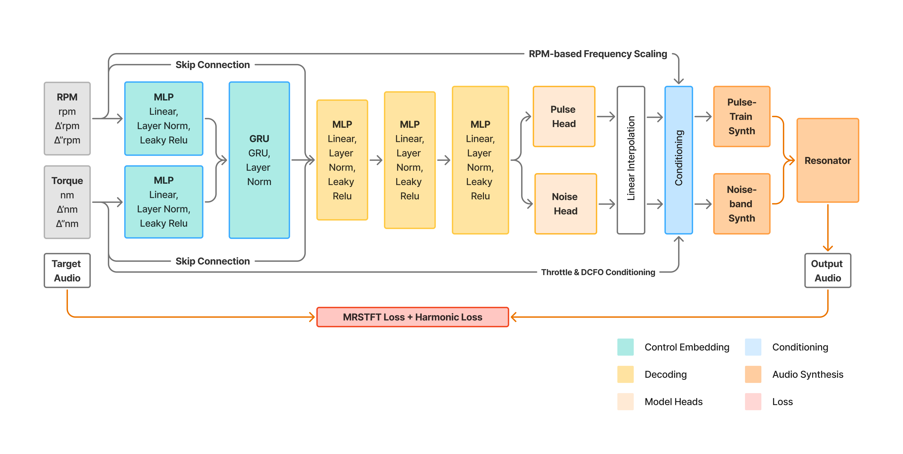

# PTR Audio Examples

**Access the interactive examples:** https://rdoerfler.github.io/ptr-examples/

Please consider listening with headphones.

**Note:** All audio examples are direct network outputs without post-processing. For easier comparison and better audibility, they have been normalized to 0dBFS on this webpage.

## Architecture



*Control features are temporally embedded via MLP and GRU, decoded into 
synthesis parameters, and conditioned before driving differentiable pulse 
synthesis and Karplus-Strong resonator modules.*

## Overview

This page contains audio examples comparing target engine sounds with the Pulse-Train-Resonator (PTR) model and a Harmonic-Plus-Noise (HPN) baseline across three datasets (A, B, C) from the Procedural Engine Sounds Dataset [1]. Datasets are presented in order of increasing complexity.

The main model development and research can be found at: https://github.com/rdoerfler/ptr-model

## What You're Hearing

- **Target**: Ground truth engine sounds from the validation set
- **HPN**: Harmonic-plus-noise baseline — produces smoother, more averaged approximations
- **PTR**: Pulse-Train-Resonator model — exhibits characteristic pulse-train signatures, particularly audible at low RPM

The examples include:
- **Best Predictions**: Validation set inference using final trained models
- **First Predictions**: Validation set using first-epoch models, revealing each architecture's inherent acoustic biases before learned data patterns take over

All examples represent unseen data, ensuring unbiased evaluation.

## References

[1] Doerfler, R. (2025). Procedural Engine Sounds Dataset (Version 1.0) [Data set]. Zenodo. https://doi.org/10.5281/zenodo.16883336

<details>
<summary>BibTeX</summary>

```bibtex
@dataset{doerfler_2025_procedural_engine_sounds,
  author       = {Doerfler, Robin},
  title        = {Procedural Engine Sounds Dataset},
  month        = {August},
  year         = 2025,
  publisher    = {Zenodo},
  version      = {1.0},
  doi          = {10.5281/zenodo.16883336},
  url          = {https://doi.org/10.5281/zenodo.16883336}
}
```

</details>

## Model Performance

Best validation losses (lower is better):

| Dataset | HPN Harmonic | HPN STFT | HPN Total | PTR Harmonic | PTR STFT | PTR Total |
|---------|--------------|----------|-----------|--------------|----------|-----------|
| A       | 0.107        | 1.781    | 0.944     | **0.090**    | **1.649** | **0.872** |
| B       | 0.059        | 1.824    | 0.943     | **0.055**    | **1.754** | **0.907** |
| C       | 0.166        | 2.093    | 1.132     | **0.117**    | **2.017** | **1.069** |
| Mean    | 0.111        | 1.899    | 1.006     | 0.088        | 1.807     | 0.949     |

PTR models consistently outperform HPN across all datasets and loss components.
